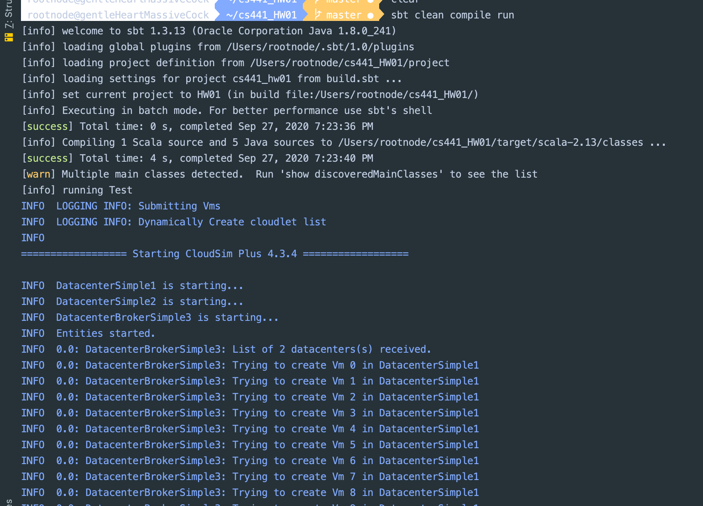
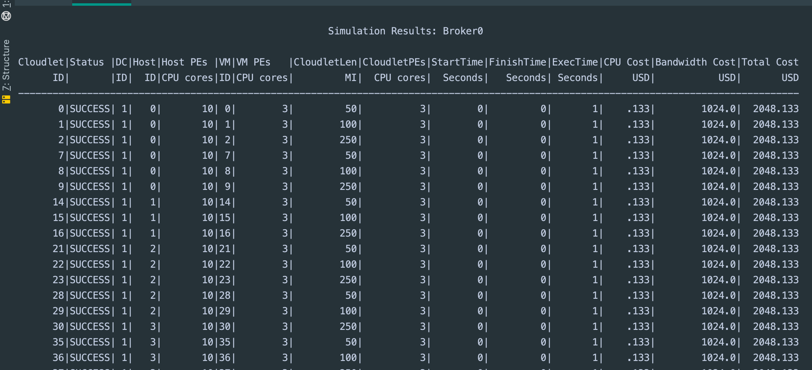
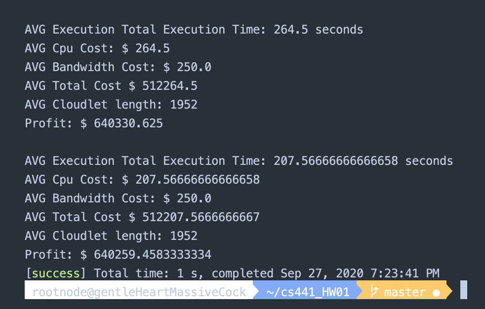

# CS441 - Engineering Distributed Objects for Cloud Computing

# HW 01 Cloud Simulation using Cloudsim - Plus

## Description 
In this project, I analyze various cloud architectures with multiple datacenters from the perspective of a cloud computing broker.
Cloudlets are assigned to Virtual Machines via time - shared and space - shared schedulers for comparison.
Each Virtual Machine houses Cloudlets with different allocation policies, BestFit and FirstFit. 
Various utilization models are used for cloudlets, from stochastic models to using the entire cloudlet resource until full.
An analysis and computational statistics are done to differentiate the various pros and cons across different cloud architectures.

## Installation

To use this framework, be sure to have the following software installed:  

* [Java SE Development Kit 11](https://www.oracle.com/java/technologies/javase-jdk11-downloads.html)
* [sbt 1.3.x ](https://www.scala-sbt.org/download.html)
* [Scala  2.13.x](https://www.scala-lang.org/download/) 
* [IntelliJ IDEA](https://www.jetbrains.com/idea/download/)

To install this package into a project:  

1.  Download cs441_Fall2020_HW01

    ```  
    git clone https://jsanch75@bitbucket.org/jsanch75/cs441_fall2020_hw01.git
    ```
2. Navigate to the project root folder  

    ```
    cd cs441_Fall2020_HW01/  
    ```
3. Execute the command on the command line:

    ```
    sbt clean compile run  
    ```  
   
## Cloud Simulation Architecture 

## Virtual Memory Allocation Policies 

## Load Balancing 

## Simulation Results and Analysis




## References
* [CloudSim Plus API](http://cloudsimplus.org/) 
* [CloudSim Plus Vertical CPU Scaling Example](https://github.com/manoelcampos/cloudsim-plus/blob/master/cloudsim-plus-examples/src/main/java/org/cloudsimplus/examples/autoscaling/VerticalVmCpuScalingExample.java)
* [Lightbend Configuration](https://github.com/lightbend/config)
* [SLF4J Logging](http://slf4j.org/manual.html)
* [sbt Reference Manual](https://www.scala-sbt.org/1.x/docs/)
